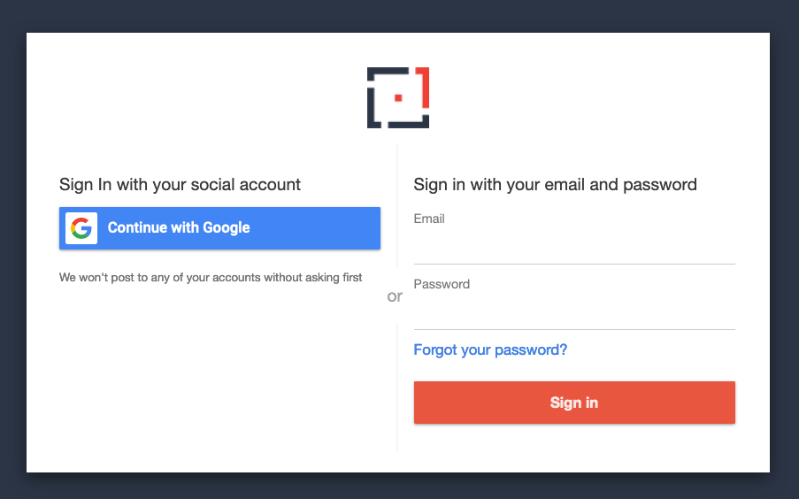

# Command Line Interface Tools (CLI) for OneBlink

## Getting Started

Before using the Command Line Interface (CLI) Tools, you will first need to download and install `Node.js` and `npm` on your local machine.

IMPORTANT: The minimum requirements for using the OneBlink CLI tools are:

- `Node.js 12.0.0`
- `npm 6.9.0`

However, it is recommended that users download the latest stable release of `Node.js`.

### Node.js

You can download `Node.js` here: https://nodejs.org/en/download/

To check if you have `Node.js` installed, run this command in your terminal:

```
node -v
```

### Node Package Manager (npm)

`npm` comes with `Node.js`

This means that when you download `Node.js`, you automatically get `npm` installed on your local machine.

To confirm that you have `npm` installed you can run this command in your terminal:

```
npm -v
```

## Installation of CLI Tools

To install the CLI tools, open a terminal (On Windows, this can be `cmd.exe` and on MacOS, this can be the `Terminal.app`) and type in the following command:

```
npm install -g @blinkmobile/cli @blinkmobile/identity-cli @blinkmobile/server-cli
```

**Note: if you are using Windows, you might have to close your terminal (`cmd.exe`) and open it up again for the changes to take effect.**

This will install:

- Client CLI
- Server CLI
- Identity CLI

## Logging in using Identity CLI

Now that you have `identity-cli` installed, you can go back to the terminal and type in:

```
bm identity login
```

A browser window will open and you'll be able to select your identity provider. Usually this would be your work Gmail account (click the `Continue with Google` button). If not, just login with your OneBlink username and password.

<center>



</center>

Once you log in, you will be provided with a code to copy and paste into your terminal.

<center>


</center>

This will authenticate you, and you will now be logged in.
